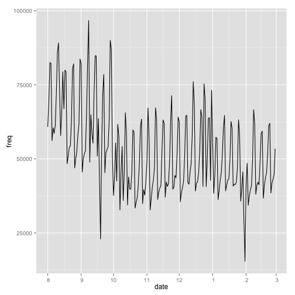
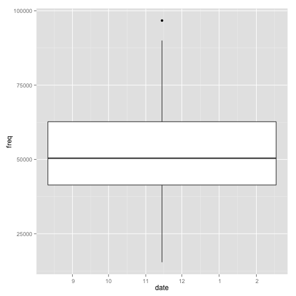

# 배달업종 이용분석 #1


데이터 출처: [bigdatahub.co.kr](http://bigdatahub.co.kr)


```r
datapath <- "/Users/euriion/Documents/workspace/nexr-analytics/codes/fastfood_delivery/data/"
```


저장된 파일 목록을 살펴봅니다.


```r
system(paste("cd", datapath, "; ", "ls -1 *.tsv"))
```


```r
filenames <- system(paste("cd", datapath, "; ", "ls -1 *.tsv"), intern = T)
```


filename들이 잘 정해졌는지 봅니다.


```r
filenames
```

```
## [1] "야식+배달업종+이용+현황분석_2013년+08월.tsv" "배달업종_이용현황분석_201309.tsv"     "배달업종_이용현황분석_201310.tsv"    
## [4] "배달업종_이용현황분석_201311.tsv"     "배달업종_이용현황분석_201312.tsv"     "배달업종_이용현황분석_201401.tsv"    
## [7] "배달업종_이용현황분석_201402.tsv"
```


7개의 파일이 잘 있습니다.  
> 한글 자모가 분리된 형태로 보일 수 있는데 제 작업PC가  Mac OS X라서 그렇습니다.
> 문제는 없습니다.


```r
system(paste("cd", datapath, "; ", "ls -1 *.tsv | xargs -n 1 head -1  | sort | uniq -c"))
```


```r
if (!require(plyr)) {
    install.packages("plyr")
}
```

```
## Loading required package: plyr
```


이제 paste0를 이용해 파일 이름들의 fullpath 벡터를 만들어줍니다.


```r
filenames.fullpath <- paste0(datapath, filenames)
filenames.fullpath
```

```
## [1] "/Users/euriion/Documents/workspace/nexr-analytics/codes/fastfood_delivery/data/야식+배달업종+이용+현황분석_2013년+08월.tsv"
## [2] "/Users/euriion/Documents/workspace/nexr-analytics/codes/fastfood_delivery/data/배달업종_이용현황분석_201309.tsv"    
## [3] "/Users/euriion/Documents/workspace/nexr-analytics/codes/fastfood_delivery/data/배달업종_이용현황분석_201310.tsv"    
## [4] "/Users/euriion/Documents/workspace/nexr-analytics/codes/fastfood_delivery/data/배달업종_이용현황분석_201311.tsv"    
## [5] "/Users/euriion/Documents/workspace/nexr-analytics/codes/fastfood_delivery/data/배달업종_이용현황분석_201312.tsv"    
## [6] "/Users/euriion/Documents/workspace/nexr-analytics/codes/fastfood_delivery/data/배달업종_이용현황분석_201401.tsv"    
## [7] "/Users/euriion/Documents/workspace/nexr-analytics/codes/fastfood_delivery/data/배달업종_이용현황분석_201402.tsv"
```


파일 이름이 절대경로로 잘 붙어 있는 것을 확인할 수 있습니다.

자 이제 ldply를 이용해서 몽땅 불러옵니다.  
header를 읽지 않기 위해서 skip=1 옵션을 준 것을 주의하세요.


```r
df <- ldply(filenames.fullpath, function(filename) data.frame(Filename = filename, 
    read.table(filename, , sep = "\t", header = F, skip = 1)))
```


자 읽어 왔습니다. 내용을 확인해 봅니다.

```r
head(df)
```

확인해보니 ldply를 사용하면서column이 하나 더 붙었습니다만  
그것은 나중에 확인하기로 하고  
우선 레코드를 빼먹지 않고 모두 data.frame으로 읽어 왔는지 확인해 봅니다.

```r
NROW(df)
```

총 19229 개의 레코드가 읽혔는데 맞는지 확인해 봅니다.

unix명령어의 wc를 이용해서 확인합니다.


```r
system(paste("cd", filepath, "; ", "wc -l *.tsv"))
```

```
## Error: 객체 'filepath'를 찾을 수 없습니다
```


```r
colnames(df)
```

```
## [1] "Filename" "V1"       "V2"       "V3"       "V4"       "V5"
```


안 바꿔도 되겠지만 컬럼의 의미를 인식하기 어려우므로 바꿔줍니다.  
그전에 맨 앞의 컬럼은 filename인데 쓸모가 없으므로 먼저 제거합니다.


```r
df <- df[-1]
```


이제 컬럼명을 붙여줍니다.  
> 컬럼이름이 무식하지만 체신청에서도 채택하고 있는  전통적으로 많이 쓰는 스타일입니다.


```r
colnames(df) <- c("date", "weekday", "time", "type", "freq")
```


잘 바뀌었는지 확인해 봅니다.


```r
head(df, 50)
```

```
##              date weekday     time          type freq
## 1  2013년08월01일      목 00시간대 족발/보쌈전문  115
## 2  2013년08월01일      목 01시간대 족발/보쌈전문   75
## 3  2013년08월01일      목 02시간대 족발/보쌈전문   38
## 4  2013년08월01일      목 03시간대 족발/보쌈전문   20
## 5  2013년08월01일      목 04시간대 족발/보쌈전문   22
## 6  2013년08월01일      목 05시간대 족발/보쌈전문   17
## 7  2013년08월01일      목 06시간대 족발/보쌈전문    9
## 8  2013년08월01일      목 07시간대 족발/보쌈전문   13
## 9  2013년08월01일      목 08시간대 족발/보쌈전문    9
## 10 2013년08월01일      목 09시간대 족발/보쌈전문   18
## 11 2013년08월01일      목 10시간대 족발/보쌈전문   34
## 12 2013년08월01일      목 11시간대 족발/보쌈전문   77
## 13 2013년08월01일      목 12시간대 족발/보쌈전문   91
## 14 2013년08월01일      목 13시간대 족발/보쌈전문   93
## 15 2013년08월01일      목 14시간대 족발/보쌈전문   77
## 16 2013년08월01일      목 15시간대 족발/보쌈전문   97
## 17 2013년08월01일      목 16시간대 족발/보쌈전문  121
## 18 2013년08월01일      목 17시간대 족발/보쌈전문  206
## 19 2013년08월01일      목 18시간대 족발/보쌈전문  373
## 20 2013년08월01일      목 19시간대 족발/보쌈전문  450
## 21 2013년08월01일      목 20시간대 족발/보쌈전문  366
## 22 2013년08월01일      목 21시간대 족발/보쌈전문  277
## 23 2013년08월01일      목 22시간대 족발/보쌈전문  213
## 24 2013년08월01일      목 23시간대 족발/보쌈전문  178
## 25 2013년08월01일      목 00시간대      중국음식  256
## 26 2013년08월01일      목 01시간대      중국음식  226
## 27 2013년08월01일      목 02시간대      중국음식  210
## 28 2013년08월01일      목 03시간대      중국음식  156
## 29 2013년08월01일      목 04시간대      중국음식  144
## 30 2013년08월01일      목 05시간대      중국음식  120
## 31 2013년08월01일      목 06시간대      중국음식   91
## 32 2013년08월01일      목 07시간대      중국음식  101
## 33 2013년08월01일      목 08시간대      중국음식  147
## 34 2013년08월01일      목 09시간대      중국음식  317
## 35 2013년08월01일      목 10시간대      중국음식  915
## 36 2013년08월01일      목 11시간대      중국음식 2992
## 37 2013년08월01일      목 12시간대      중국음식 4399
## 38 2013년08월01일      목 13시간대      중국음식 3449
## 39 2013년08월01일      목 14시간대      중국음식 2249
## 40 2013년08월01일      목 15시간대      중국음식 1703
## 41 2013년08월01일      목 16시간대      중국음식 1513
## 42 2013년08월01일      목 17시간대      중국음식 1779
## 43 2013년08월01일      목 18시간대      중국음식 2599
## 44 2013년08월01일      목 19시간대      중국음식 2942
## 45 2013년08월01일      목 20시간대      중국음식 1760
## 46 2013년08월01일      목 21시간대      중국음식  631
## 47 2013년08월01일      목 22시간대      중국음식  347
## 48 2013년08월01일      목 23시간대      중국음식  264
## 49 2013년08월01일      목 00시간대          치킨  864
## 50 2013년08월01일      목 01시간대          치킨  306
```


데이터 먼징

날짜포맷을 맞춰서 POSIX타입으로 변경


```r
# gsub('(.*)년(.*)월(.*)일', '\\1\\2\\3', '2013년08월25일')
df$date <- gsub("(.*)년(.*)월(.*)일", "\\1\\2\\3", df$date)
df$date <- as.POSIXlt(df$date, tz = "KST", format = "%Y%m%d")
df$date <- as.Date(df$date)
```


시간대 포맷도 이상한 것이 있으므로 모두 맞춘다.


```r
# gsub('(.*)시간대', '\\1', '00시간대')
df$time <- gsub("(.*)시간대", "\\1", df$time)
# colnames(df) <- c('dt', 'weekday', 'hour', 'foodtype', 'freq')
```


트렌드 플로팅을 위한 aggregation


```r
df.aggrbytime <- aggregate(freq ~ time, data = df, FUN = sum)
df.aggrbydate <- aggregate(freq ~ date, data = df, FUN = sum)
df.aggrbyweekday <- aggregate(freq ~ weekday, data = df, FUN = median)
```


주경향 시계열


```r
library(ggplot2)
ggp <- ggplot(data = df.aggrbydate, aes(x = date, y = freq)) + geom_line()
ggp
```

 


하루에 판매된 배달음식의 분포 (boxplot)

```r
plot(df.aggrbyweekday)
```

```
## Warning: conversion failure on '금' in 'mbcsToSbcs': dot substituted for <ea>
## Warning: conversion failure on '금' in 'mbcsToSbcs': dot substituted for <b8>
## Warning: conversion failure on '금' in 'mbcsToSbcs': dot substituted for <88>
## Warning: conversion failure on '금' in 'mbcsToSbcs': dot substituted for <ea>
## Warning: conversion failure on '금' in 'mbcsToSbcs': dot substituted for <b8>
## Warning: conversion failure on '금' in 'mbcsToSbcs': dot substituted for <88>
## Warning: conversion failure on '목' in 'mbcsToSbcs': dot substituted for <eb>
## Warning: conversion failure on '목' in 'mbcsToSbcs': dot substituted for <aa>
## Warning: conversion failure on '목' in 'mbcsToSbcs': dot substituted for <a9>
## Warning: conversion failure on '목' in 'mbcsToSbcs': dot substituted for <eb>
## Warning: conversion failure on '목' in 'mbcsToSbcs': dot substituted for <aa>
## Warning: conversion failure on '목' in 'mbcsToSbcs': dot substituted for <a9>
## Warning: conversion failure on '수' in 'mbcsToSbcs': dot substituted for <ec>
## Warning: conversion failure on '수' in 'mbcsToSbcs': dot substituted for <88>
## Warning: conversion failure on '수' in 'mbcsToSbcs': dot substituted for <98>
## Warning: conversion failure on '수' in 'mbcsToSbcs': dot substituted for <ec>
## Warning: conversion failure on '수' in 'mbcsToSbcs': dot substituted for <88>
## Warning: conversion failure on '수' in 'mbcsToSbcs': dot substituted for <98>
## Warning: conversion failure on '월' in 'mbcsToSbcs': dot substituted for <ec>
## Warning: conversion failure on '월' in 'mbcsToSbcs': dot substituted for <9b>
## Warning: conversion failure on '월' in 'mbcsToSbcs': dot substituted for <94>
## Warning: conversion failure on '월' in 'mbcsToSbcs': dot substituted for <ec>
## Warning: conversion failure on '월' in 'mbcsToSbcs': dot substituted for <9b>
## Warning: conversion failure on '월' in 'mbcsToSbcs': dot substituted for <94>
## Warning: conversion failure on '일' in 'mbcsToSbcs': dot substituted for <ec>
## Warning: conversion failure on '일' in 'mbcsToSbcs': dot substituted for <9d>
## Warning: conversion failure on '일' in 'mbcsToSbcs': dot substituted for <bc>
## Warning: conversion failure on '일' in 'mbcsToSbcs': dot substituted for <ec>
## Warning: conversion failure on '일' in 'mbcsToSbcs': dot substituted for <9d>
## Warning: conversion failure on '일' in 'mbcsToSbcs': dot substituted for <bc>
## Warning: conversion failure on '토' in 'mbcsToSbcs': dot substituted for <ed>
## Warning: conversion failure on '토' in 'mbcsToSbcs': dot substituted for <86>
## Warning: conversion failure on '토' in 'mbcsToSbcs': dot substituted for <a0>
## Warning: conversion failure on '토' in 'mbcsToSbcs': dot substituted for <ed>
## Warning: conversion failure on '토' in 'mbcsToSbcs': dot substituted for <86>
## Warning: conversion failure on '토' in 'mbcsToSbcs': dot substituted for <a0>
## Warning: conversion failure on '화' in 'mbcsToSbcs': dot substituted for <ed>
## Warning: conversion failure on '화' in 'mbcsToSbcs': dot substituted for <99>
## Warning: conversion failure on '화' in 'mbcsToSbcs': dot substituted for <94>
## Warning: conversion failure on '화' in 'mbcsToSbcs': dot substituted for <ed>
## Warning: conversion failure on '화' in 'mbcsToSbcs': dot substituted for <99>
## Warning: conversion failure on '화' in 'mbcsToSbcs': dot substituted for <94>
```

 

```r

ggp <- ggplot(data = df.aggrbydate, aes(x = date, y = freq)) + geom_boxplot()
ggp
```

 

```r


a <- boxplot(df.aggrbydate$freq)
```

 

```r
is(a)
```

```
## [1] "list"   "vector"
```

```r
class(a)
```

```
## [1] "list"
```

```r
summary(df.aggrbydate$freq)
```

```
##    Min. 1st Qu.  Median    Mean 3rd Qu.    Max. 
##   15400   41400   50400   53000   62700   96700
```


